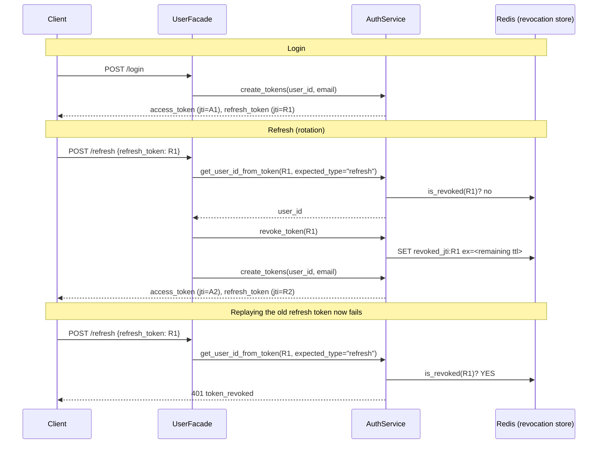

# Authentication

JWT-based auth with strictly-typed, revocable access/refresh tokens. This document covers the
full token lifecycle and the security properties that make it more than "just JWT."

## Endpoints

| Method | Path | Auth required | Rate limit |
|---|---|---|---|
| `POST` | `/api/v1/users/register` | — | 10/minute |
| `POST` | `/api/v1/users/login` | — | 20/minute |
| `POST` | `/api/v1/users/refresh` | — (refresh token in body) | 30/minute |
| `POST` | `/api/v1/users/logout` | ✅ access token | — |
| `GET` | `/api/v1/users/me` | ✅ access token | — |

Rate limits are per-route, enforced by `slowapi` (`app/infrastructure/security/rate_limiter.py`),
keyed by remote address.

## Token Anatomy

Both access and refresh tokens are JWTs (HS256 by default, `JWT_ALGORITHM` env var) with these
claims (`app/infrastructure/security/jwt_handler.py`):

```json
{
  "sub": "42",              // user id, as a string
  "iat": 1234567890,        // issued-at
  "exp": 1234569690,        // expiry
  "type": "access",         // "access" or "refresh" — see below
  "jti": "b3f1...-uuid4",   // unique token id, used for revocation
  "email": "user@example.com"  // access tokens only, via extra_claims
}
```

Lifetimes are configurable: `JWT_ACCESS_TOKEN_EXPIRE_MINUTES` (default 30),
`JWT_REFRESH_TOKEN_EXPIRE_DAYS` (default 7).

## Why `type` Matters: Access/Refresh Confusion

A common JWT implementation mistake: issuing access and refresh tokens that are
structurally identical, so a refresh token (long-lived, meant only to mint new access
tokens) can be replayed directly against protected endpoints, or an access token
(short-lived, meant only for API calls) can be replayed against the refresh endpoint to
mint fresh tokens indefinitely.

This template closes that gap with the `type` claim, enforced on every decode:

```python
# app/infrastructure/security/jwt_handler.py
def decode_token(self, token: str, expected_type: str | None = None) -> Result[dict, DomainError]:
    ...
    if expected_type is not None and payload.get("type") != expected_type:
        return Err(DomainError.invalid_token(f"Expected a '{expected_type}' token."))
    return Ok(payload)
```

Every call site passes the type it actually expects:

- `UserFacade.get_current_user()` (used by `/me`, `/logout`, and the `CurrentUser` /
  `CurrentSuperUser` FastAPI dependencies) calls
  `get_user_id_from_token(token, expected_type="access")`.
- `UserFacade.refresh_tokens()` calls `get_user_id_from_token(refresh_token, expected_type="refresh")`.

A refresh token presented to `/me` — or an access token presented to `/refresh` — is
rejected with `401 invalid_token`, not silently accepted.

## Revocation and Rotation

Tokens are revocable via a Redis-backed blacklist keyed by `jti`
(`app/infrastructure/security/token_revocation.py`, `ITokenRevocationStore` interface in
`app/application/services/auth_service.py`). A revoked key is stored with a TTL equal to the
token's own remaining lifetime — no need to remember to clean it up; Redis expires it exactly
when the token itself would have expired anyway.

Two things use this:

1. **`POST /logout`** revokes the access token used to authenticate the request and, if
   supplied in the body, the refresh token too. Idempotent — logging out twice, or with an
   already-expired token, doesn't error (see `AuthService.revoke_token()`'s
   decode-and-silently-no-op-on-failure behavior).
2. **Refresh rotation**: every successful `POST /refresh` revokes the refresh token it was
   just given, before issuing a new access/refresh pair. A refresh token is single-use — if
   it's replayed (e.g. an attacker captured it in transit and the legitimate client already
   used it), the second use fails with `401 token_revoked`.



## Password Hashing

`app/infrastructure/security/password_hasher.py` uses the `bcrypt` library directly (not
`passlib` — see the module docstring for why: `passlib` is unmaintained and incompatible with
`bcrypt`>=4.1's stricter 72-byte secret handling). Secrets longer than 72 bytes are truncated
before hashing, matching bcrypt's own historical behavior, so hashing never raises on long
input.

`AuthService.hash_password()` additionally enforces an 8-character minimum before it ever
reaches the hasher (`app/application/services/auth_service.py`).

## Authorization Levels

`app/presentation/api/v1/auth_middleware.py` builds three FastAPI dependencies from one
chain:

```
get_current_user          decodes the Bearer token (expected_type="access")
  -> get_current_active_user   + 403 if user.is_active is False
       -> get_current_superuser    + 403 if user.is_superuser is False
```

Routes use the `CurrentUser` (active user) or `CurrentSuperUser` (superuser-only) type
aliases as a parameter annotation — e.g. `DELETE /api/v1/users/{id}` requires
`CurrentSuperUser`. There's no API path to promote a user to superuser (by design); it's a
direct database operation, e.g. `UPDATE users SET is_superuser = true WHERE id = ...`.

## Extending This

Swapping the revocation store (e.g. for a clustered Redis setup, or a different backend
entirely) means implementing `ITokenRevocationStore` and rewiring one line in
`app/infrastructure/dependencies.py` — nothing in `AuthService` or above it changes, since it
only depends on the interface.
